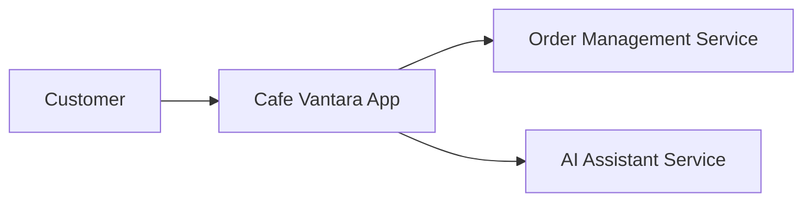

# 🚀 Cafe Vantara

> A smart cafe management system enhanced with conversational AI.

### 🌐 Live Demo
[🚀 OPEN LIVE DEMO →](https://cafevantara.vercel.app) | [💻 Source Code](https://github.com/YUVA-2329/cafevantara) 

---

## 🎬 Demo & 📸 Screenshots


*(Project preview and screenshots demonstrating the core user experience)*

---

## 🧠 About the Project

This project was built to solve real-world challenges through modern web technologies and advanced engineering. By combining scalable architecture with an intuitive user interface, Cafe Vantara provides an exceptional user experience while maintaining high performance and security.

### ✨ Key Features
- ☕ Digital Menu & Ordering System
- 🤖 Conversational AI assistant for recommendations
- 🎨 Smooth page transitions with Framer Motion
- 📱 Mobile-first responsive design
- ⚡ Fast rendering with Vite

---

## 🛠️ Tech Stack

**Frontend:** React, TypeScript, Tailwind CSS, Framer Motion
**Backend:** Node.js, Express
**AI:** Google GenAI

---

## 🏗️ Architecture



---

## ⚙️ How It Works

1. Customers view the digital menu and interact with the UI.
2. They can ask the AI assistant for dietary recommendations (e.g., vegan options).
3. Orders are processed instantly and routed to the cafe's backend system.

---

## 🚀 Getting Started

### Installation

```bash
git clone https://github.com/YUVA-2329/cafevantara.git
cd cafe-vantara
npm install
npm run dev
```

### Environment Variables
Create a `.env` file in the root directory:
```env
PORT=3000
GEMINI_API_KEY=YOUR_API_KEY
```

---

## 📁 Project Structure

```text
project/
├── src/
│   ├── components/
│   ├── hooks/
│   └── views/
├── server.js
└── package.json
```

---

## 🛣️ Roadmap

- [x] Interactive UI
- [x] AI Assistant
- [ ] POS Integration
- [ ] Loyalty Program Module

---

## 📊 Status

🟢 Active Development

---

## 👨‍💻 Author

**Yuva Kishore Peta**  
GitHub: [YUVA-2329](https://github.com/YUVA-2329)
